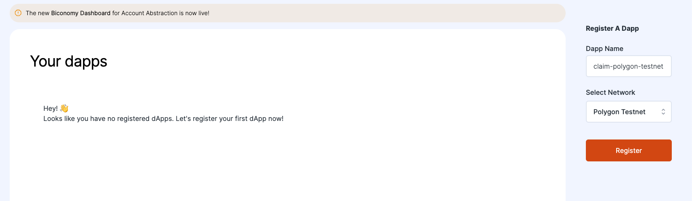
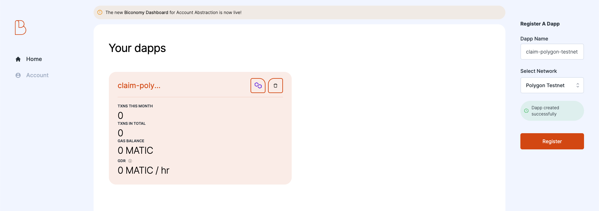
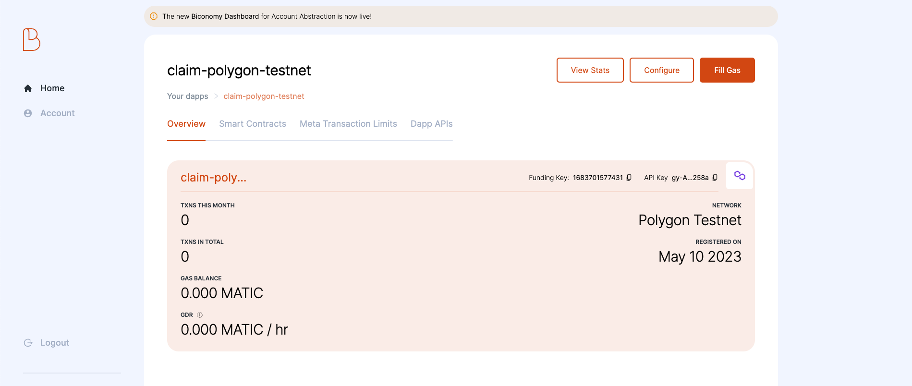
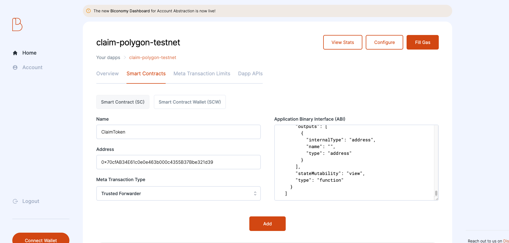
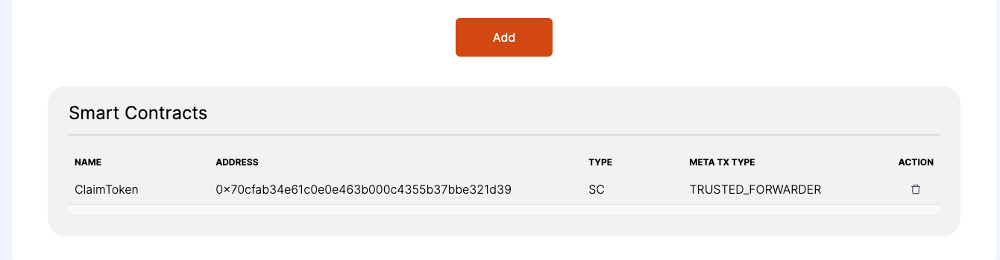
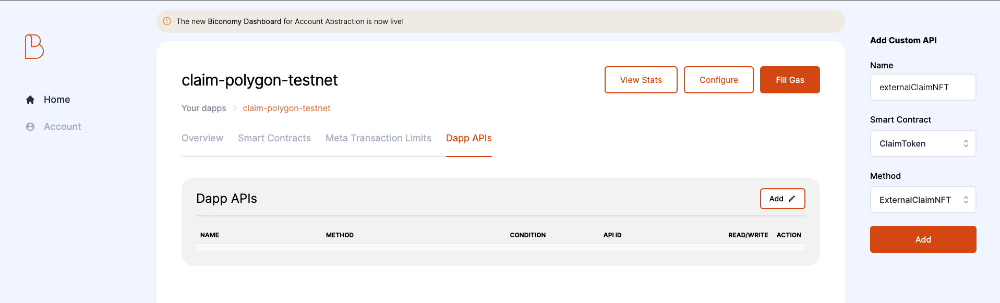
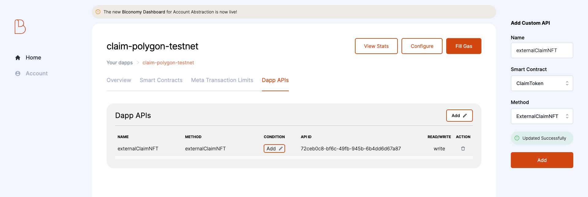
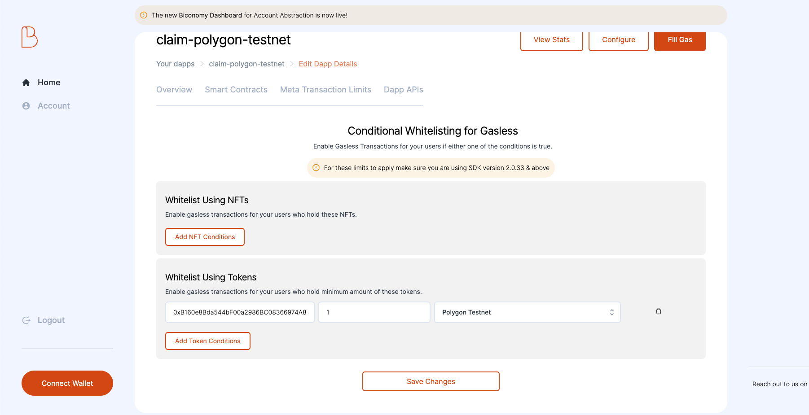
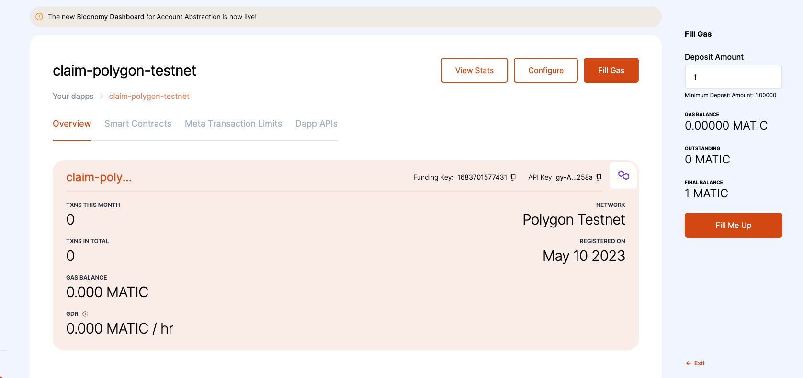
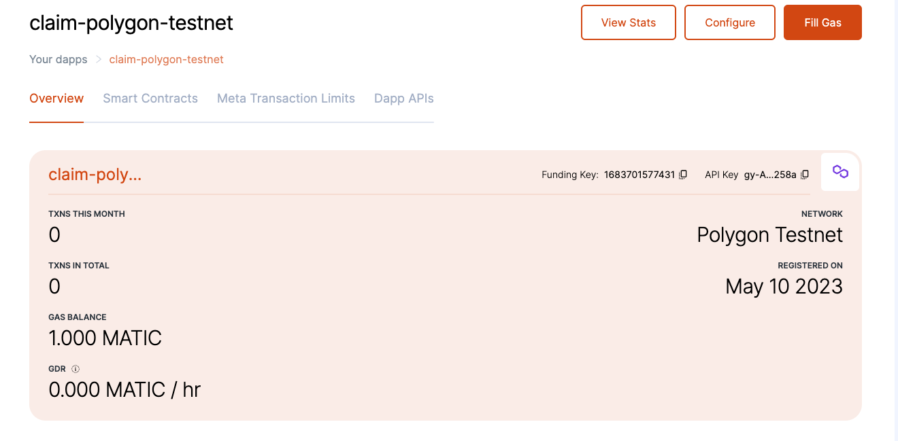

# Biconomy Setup Guide

## Content
1. [Introduction](#introduction)
2. [Prerequisites](#prerequisites)
3. [Registering Dapp](#registering-dapp)
4. [Adding Smart Contract](#adding-smart-contract)
5. [Enabling Gasless Calls](#enabling-gasless-calls)
6. [Conditional Whitelisting](#conditional-whitelisting)
7. [Funding Gas Tank](#funding-gas-tank)

## Introduction
To enable users to claim their nfts without worrying about gas, we need to configure biconomy to enable gasless transactions for the claiming process. 

## Prerequisites
- biconomy account
    - create account here (https://dashboard-gasless.biconomy.io/)
- MetaTX Compliant Contract Address ([Claim Contract](../../solidity/contracts/ClaimToken.sol))
- Gas Token Contract Address ([GasToken](../../solidity/contracts/GasToken.sol))
- the smart contract addresses will be generated once it is deployed on the network

## Registering Dapp

Before enabling gasless transaction, the dapp should be first registered on the dashboard.

1. Login to a biconomy account. (https://dashboard-gasless.biconomy.io/)
2. On the right hand side, there is a form where a dapp can be registered, input the name of the dapp and select the appropriate network then click register.

3. After successful registration, the dapp should now appear on the dashboard.

## Adding Smart Contract
1. After registering the dapp, smart contract related to the dapp can now be added, click the dapp card on the dashboard. On the dapp view, there is a dashboard with useful information like the number of transactions served and the available balance that can be used for gasless transactions. Take note also of the **API key**, it is needed by the dapp to access the biconomy api in order to send gasless transactions. To add a smart contract associated to the dapp, click on the **Smart Contracts** tab.

2. On the smart contract tab, fill the necessary information, for the smart contract name **ClaimToken** will do. For the address it should be the address where the contract is deployed, for the meta transaction type, select **Trusted Forwarder**, and lastly the abi of the smart contract. Once all are filled, click add.

3. Once the smart contract is successfully added, it will be displayed on the smart contracts list.

## Enabling Gasless Calls
1. Once the smart contract is added, create an api on biconomy that will be linked to the smart contract method that needs to enable gasless transactions. from the dapp view, click on the Dapp APIs tab.
2. From there, click add, then an Add custom api form will show on the right, fill up the necessary information. For the name, **externalClaimNFT** will do, then select the **ClaimToken** for the Smart Contract, and for the method, select **ExternalClaimNFT**. Take note that the methods will only show if the correct smart contract abi is given from the previous step. Then after the details are filled, click Add.

3. Once the api is successfully added, it will be displayed on the Dapp APIs list, take note of the **API ID** as it will be needed by the dapp to send the meta transactions.

## Conditional Whitelisting
1. As additional security the dapp, conditional whitelisting should be enable to make sure that malicious users can't drain the gas tank. From the Dapp APIs lists on the conditions column, click on add.
2. To enable gasless transactions using the ERC-20 GasToken, under **Whitelist Using Tokens**, click on **Add Token Conditions**, input fields will appear, for the contract address, add the address of the deployed [GasToken](../../solidity/contracts/GasToken.sol) contract, set the target amount to 1, then select the appropriate network. Once all the fields are done, click **Save Changes**.

## Funding Gas Tank
1. Since the dapp will shoulder the gas cost for the users, we need to fund the gas tank so it will have balance to cover the transaction costs. Before funding for the gas, make sure that the wallet has funds, then connect it to biconomy by clicking the **Connect Wallet** button at the lower left corner. For testnet, request test tokens from available faucets of then network.
2. Once the wallet has funds and is connected, on the Dapp View, click on the Fill Gas button, a form will appear on the right hand side, input how much to deposit, then click **Fill Me Up** button, the wallet will prompt to approve the transaction, approve it to deposit the funds to the gas tank.

3. After sometime the transfer is verified by the network, the balance should reflect on the Dapp View on the Overview tab, and should display the new balance, once the balance is reflected it can now be used to process gasless meta transactions.
