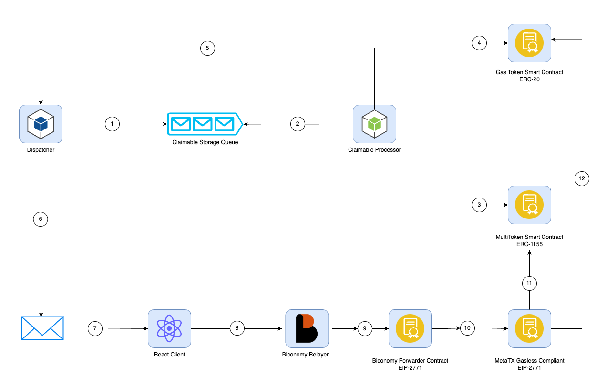

# Polygon Claimalbe NFTs

## Architecture

| Component | Description |
| :-------: | :---------: |
| `Dispatcher` | a service that stores message to the azure storage queue that contains the information about the claimable nft |
| `Claimable Storage Queue` | storage queue for claimable nfts, where dispatcher will send jobs and will be watched and processed by the claimable processor |
| `Claimable Processor` | a service that watches the claimable storage queue for claimables to create |
| `MultiToken Smart Contract` | the smart contract where the claimable(nft) is stored |
| `Gas Token Smart Contract` | an erc-20 smart contract that will be used to limit gasless calls by a specific address using [conditional whitelisting](https://docs.biconomy.io/products/enable-gasless-transactions/conditional-whitelisting#2.-using-token-holdings) |
| `React Client` | a front end application where users will interact to claim their nft |
| `Biconomy Relayer` | a service for enabling [gasless transaction](https://docs.biconomy.io/introduction/why-biconomy) |
| `Biconomy Forwarder Contract` | a smart contract deployed by biconomy that will receive and validate the meta transaction, available forwarder addresses can be found in this [list](https://docs.biconomy.io/products/hyphen-instant-cross-chain-transfers/contract-addresses), make sure that forwarder contract should be immutable and non upgradeable |

### Process Flow
1. Dispatch a claimable process job on the storage queue.
2. Processor receives the claimable process job, creating a temporary wallet with private key.
3. Transfer the target nft to the temporary wallet.
4. Mint an erc-20 token to the temporary wallet to allow it to invoke gasless transactions.
5. Processor generates the claimable link with the private key of the generated temporary wallet and sends it to the callback endpoint.
6. The claimable url is sent to the target recipient via email.
7. The claimable link redirects the user to the react app, asks them to connect a metamask wallet.
8. With the temporary private key generated, sign a meta transaction that will transfer the nft to the wallet of the user created from metamask. Biconomy relayer validates if the key that signed the transaction holds the erc-20 gas token generated.
9. If the private key that signed the meta transaction holds a specific amount of the erc-20 token, biconomy sends the meta transaction to the trusted forwarder contract.
10. The forwarder contract validates the meta transaction, then sends it to the target contract.
11. The nft is transferred form the temporary wallet to the metamask wallet of the user.
12. Burns erc-20 token from the temporary wallet, so the temporary wallet can no longer execute gas free transactions.

